#### Overview

The Assembly view shows the function's machine code after disassembly, with syntax highlighting for x86_64/ARM64 architectures. The view is interactive, with the text being parsed into instructions with operands and higher-level constructs such as [basic blocks](https://en.wikipedia.org/wiki/Basic_block) and loops are recovered.

The assembly instructions are augmented with annotations from the debug info files, such as source line numbers and inlinees, and combined with the execution time from the profile trace.

{:target="_blank"}

The view has four parts:  

- a main toolbar at the top, with general action buttons.
- a secondary toolbar underneath with profiling-specific info and action buttons.
- the text view with the function's assembly.
- several columns on the right side with the profiling data for each instruction. If CPU performance counters are found and loaded from the trace, the additional columns with metrics and the counters are appended after the last column.  

???+ note
    When a function is opened in the Assembly view, its corresponding source file is automatically loaded in the *Source File* view and its [control-flow graph (CFG)](https://en.wikipedia.org/wiki/Control-flow_graph) displayed in the *Flow Graph* view. 
    [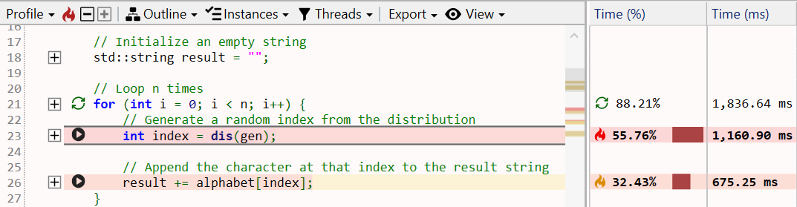](img/assembly-source_1073x279.png){:target="_blank"}

#### Assembly text view

The function assembly area can be treated a read-only code editor. Each line corresponds to one instruction, with the following values from left to right:

[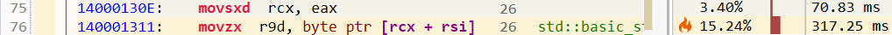](img/assembly-line_1018x41.png){:target="_blank"}

- instruction number (line number in the text).
- optional marking icon for call targets.
- instruction virtual address (blue text).
- instruction opcode (bold text).
- an optional list of instruction operands.
- source line number associated with the instruction, obtained from the debug info (gray text).
- inlinees (inlined functions) associated with the instruction, obtained from the debug info (green text).
- profiling data columns, such as the execution time percentage and value.

##### Source lines

The debug info files usually contain a mapping between the source line numbers and the instructions that were generated for those lines. If available, the source line number is appended at the end of an instruction. Note that accuracy of this mapping usually depends on the compiler optimization level, with higher levels being less accurate or even lacking the mapping for some instructions.

*Hovering* over the line number shows a tooltip with the name and path of the source file. To copy this info to clipboard, first *click* the line number, then press *Ctrl+C*.  

[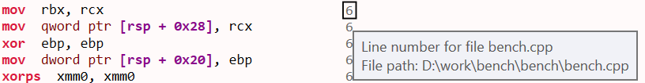{: style="width:500px"}](img/assemlby-line-number_816x106.png){:target="_blank"}  

???+ note
    *Click* on an instruction selects and brings into view its corresponding source line in the *Source File* view and its basic block in the *Flow Graph* view.  

    When multiple instructions are selected, the application status bar displays the sum of their execution time as a percentage and value.  
    {:target="_blank"}
    
##### Inlinees

During function inlining, the compiler may preserve additional details about the functions code being inlined so that the origin of an instruction can be saved into the debug info file. If available, the inlinees (inlined functions) are appended after the source line number, separated by the | letter.

For example, if the function contains a call chain like *foo() -> bar()*, with both calls being inlined, the final instructions will record the fact that they originate from *bar*, which got inlined into *foo*, then *foo* inlined into the function.

*Hovering* over the inlinee shows a tooltip with the call path (stack trace) of the functions inlined at that point. To copy this info to clipboard, first *click* the inlinee, then press *Ctrl+C*:  

[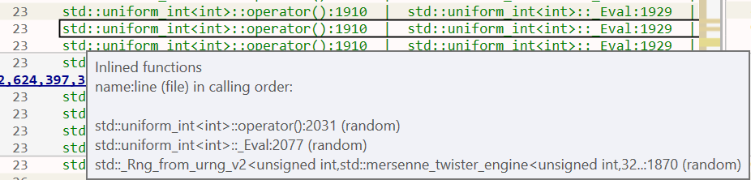{: style="width:500px"}](img/assembly-inlinees_926x222.png){:target="_blank"}

##### Basic blocks

The assembly is parsed and analyzed to recover the function's [control-flow graph (CFG)](https://en.wikipedia.org/wiki/Control-flow_graph), identifying [basic blocks](https://en.wikipedia.org/wiki/Basic_block) and loops. This information is used to split the assembly text into basic blocks and to display the Flow Graph view.

The example below shows a subset of a function's basic blocks, with the corresponding control-flow graph part from the *Flow Graph* view. The basic blocks B3-B6 are marked on the left side as folding sections that can be collapsed/expanded with a *click* on the -/+ buttons.

Notice how B5 is recognized for being a loop (the last instruction in the block jumps to the start of the block). The Flow Graph view uses a green arrow to mark loops - B4 is also the start block of a larger loop.

[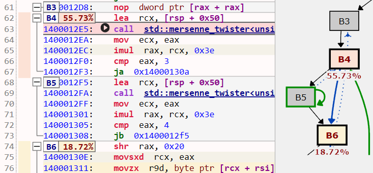{: style="width:500px"}](img/assembly-flow-graph_579x600.png){:target="_blank"}  

???+ note
    *Click* on the target address of a jump/branch instructions marks the target instruction and its basic block in the *Flow Graph* view (uses a green background color by default).  

    *Double-click* on a target address operand jumps to the target instruction.

##### Profiling annotations

Instruction execution time is displayed and annotated on several parts of the assembly instructions, columns, basic blocks and the control-flow graph, using text, colors and flame icons:

{:target="_blank"}  

- the *Time (%)* column displays the instruction's execution time percentage relative to the total function execution time. The column style can be changed in the Assembly options.
- the *Time (ms)* column displays the instruction's execution time value. The time unit and column style can be changed in the Assembly options.
- the instruction background is colored based on its execution time - the slowest instruction has a red color, next slowest orange, then shades of yellow. The instruction location is also marked in the vertical text scrollbar.
- the three slowest instructions also have a flame icon in the *Time (%)* column using the same color coding.

{:target="_blank"}  

- the basic blocks have a label with the block's execution time percentage, as a sum of its instruction's execution time (in the example above, the 55.73% label for B4). *Hovering* over the label shows the block's execution time value. The label background color uses the same color coding.
- the basic blocks in the *Flow Graph* view have below the same execution time percentage label as in the Assembly view, with the corresponding background color.

???+ note
    When displaying a function for the first time, by default, the slowest instruction is selected and brought into view (this can be configured in the Assembly options). 
    When the function is displayed subsequently, the last vertical scroll position is used instead.

    To jump at any time to the slowest instruction, *click* the red  from the toolbar or the *Ctrl+H* keyboard shortcut.

##### Call targets

Combining the parsed assembly and profiling information, call instructions are marked with their target(s) and have an arrow icon placed before the call opcode:  

- for direct calls (target is an function name/address), a black arrow is used.
- for indirect or virtual function calls (target is a register or memory operand), a green arrow is used.

*Hovering* with the mouse over the arrow displays a target functions list, with details about their execution time. For example, the indirect call below at runtime has the *std::_Random_device* function as the only target:

[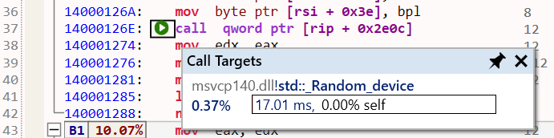{: style="width:500px"}](img/assembly-call-target_691x172.png){:target="_blank"} 

???+ note
    Functions in the list have a right-click context menu with options to open the Assembly view, preview popup, and select the function in the other views. *Double-click/Ctrl+Return* opens the Assembly view for the selected function. Combine these shortcuts with the *Shift* key to open the Assembly view in a new tab instead.

 Call instructions with a known target have the function name operand changed into a link (underlined, bold, blue text). The link makes it easy to navigate to the called function and the function history to go back to the caller.

- *Double-click* on the function name (or the Return key with the name selected) opens the called function in the same tab.  
- *Shift+Double-Click* (or Shift+Return) opens the called function in a new tab.  
- *Alt+Return* shows a preview popup with the called function's assembly. Press the *Escape* key to close the popup.  
- *Hovering* with the mouse over the function name also shows the preview popup.
- Use the shortcuts from the *Opened function history* section below to go back to the caller.

[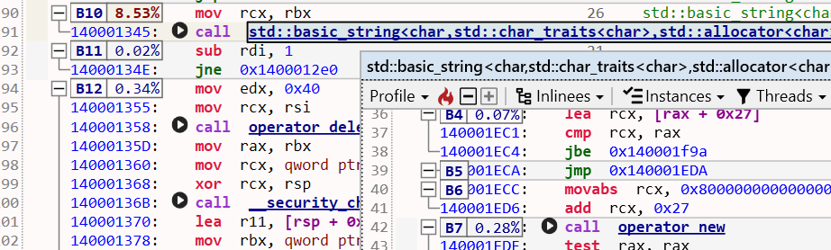](img/assembly-call-hover_922x278.png){:target="_blank"}  

##### Opened functions history

When multiple functions are opened in the same tab, a history is kept per tab that makes it possible to go back/forward to a previous/next opened function. This is especially useful when navigating to a called function by double-clicking its name in the assembly, since it makes it easy to back to the caller.  

- *Click* the *Back* button in the toolbar to navigate back to the previous function in the sequence (or press the *Backspace* key or the optional *Back* button on the mouse). The back button also has a menu that lists the previous functions.  

- *Click* the > button in the toolbar to navigate to the next function in the sequence (or press the optional *Forward* button on the mouse).  

[{: style="width:450px"}](img/assembly-back-menu_608x154.png){:target="_blank"}  

#### Profiling toolbar

The profiling toolbar provides more advanced functionality for identifying the slow parts of a function and filtering the profiling data based on a function instance and the threads the function executed on. The following sections document the main functionality.  

##### Profile

Displays a menu with the slowest instructions, sorted by execution time in decreasing order.  

- *Click* on a menu entry to select and bring the instruction into view.  
- *Click* the  icon to jump to the slowest instruction in the function.  
- *Click* the +/- buttons to jump to the next/previous slowest instruction in the sequence.

[{: style="width:550px"}](img/assembly-profile_782x436.png){:target="_blank"}  

##### Blocks

Displays a menu with the slowest blocks, sorted by execution time in decreasing order.  
*Click* on a menu entry to select and bring the start of the block into view.

[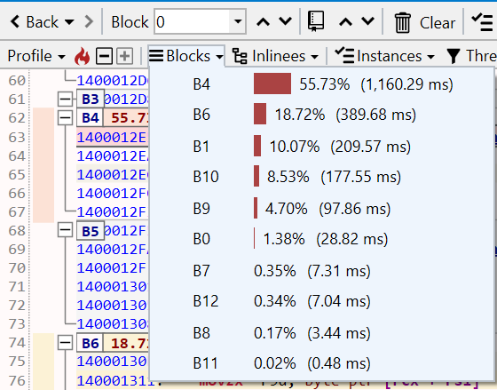{: style="width:400px"}](img/assembly-blocks_560x439.png){:target="_blank"}  

##### Inlinees

Displays a menu with the inlinees (inlined functions) that directly contribute slow instructions, sorted by the execution time of all instructions originating from a particular inlinee in decreasing order.  

{:target="_blank"}  

*Click* on a menu entry to select all instruction associated with the inlinee and brings the first one into view.  

In the example above, most of the execution time (46.79%) is taken by instructions originating in the *std::_Rng_from_...* inlinee, while only 3.60% of execution time is from non-inlined instructions.

##### Instances

By default the Assembly view displays the function profile accumulated across all instances the function (see the [Flame Graph view](flame-graph-panel.md) documentation for more details about instances). Filtering the function profile based on an instance makes it possible to better understand when certain parts of the function dominate execution time (for example, based on a parameter passed by the caller, one part or another of the function executes).  

The Instances menu displays the call paths leading to all instances of the function, with their execution time percentage and value. The menu entries use a compact form of the call path, where the first name is the caller, then it's caller, going up the call tree. Hover over an entry to display a tooltip with the complete call path.

[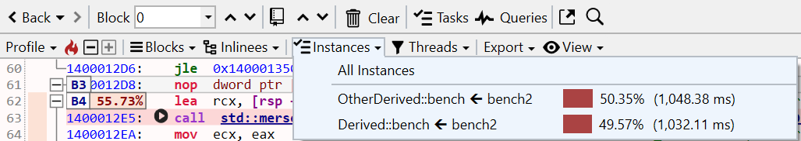](img/assembly-instances_1027x182.png){:target="_blank"}  

*Click* on a menu entry to filter the profile data to include only the selected instance, updating the execution time and all profiling annotations for instructions and basic blocks.  

The menu entries are checkboxes which allows selecting multiple instances to be included.  
Use the *All Instances* entry or uncheck all instances to view the entire function profile again.

##### Threads

By default the Assembly view displays the function profile accumulated across all threads the function executed on. Similar to instances, the profile can be filtered to consider only a subset of the threads. The Threads menu displays the threads IDs and their execution time percentage and value.  

The menu entries are checkboxes which allows selecting multiple threads to be included.  
Use the *All Threads* entry or uncheck all instances to view the entire function profile again.

[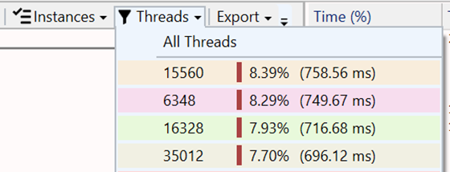{: style="width:350px"}](img/assembly-threads_560x214.png){:target="_blank"}  

???+ note
    *Hovering* with the mouse over the Assembly view tab displays a tooltip with details such as the total/self execution time, module and complete function name and if filtering is used, the name of the instances and threads included in the view. 

##### Export

See the [Exporting](#exporting) documentation section below.

##### View

Displays a menu which allows selecting the columns that should be displayed.  
The settings are saved across sessions when closing the application.

[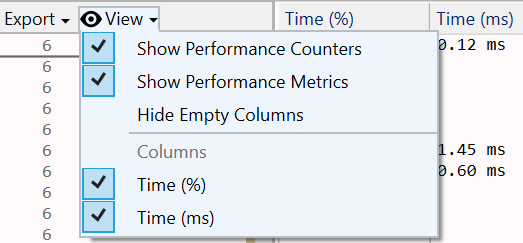{: style="width:350px"}](img/assembly-view-menu_523x243.png){:target="_blank"} 

#### View interaction

???+ abstract "Toolbar"
    | Button | Description |
    | ------ | ------------|
    | | Navigate back to a previously opened function or the next one in the sequence. See the [Opened functions history](#opened-functions-history) section for more details. |
    | {: style="width:200px"} | The dropdown displays a list of all basic blocks, selecting one jumps to it. |
    |  | Jumps to the previous/next basic block in the function. |
    |  | Displays a menu with options for viewing, setting and removing bookmarks associated with instructions. The up/down arrows jump to the previous/next bookmark. |
    |  | Displays a menu with options for removing markings from the selected or all instructions and operands. |
    |  | Opens the current function into a new preview popup. |
    |  | Displays the text search panel. Press the *Escape* key to reset the search and close the panel. |

???+ abstract "Mouse shortcuts"
    | Action | Description |
    | ------ | ------------|
    | Hover | Hovering over a call target function name displays a popup with the function's assembly. Pin or drag the popup to keep it open. |
    | Click | Selects an instruction and also selects and brings into view its corresponding source line in the *Source File* view and its basic block in the *Flow Graph* view. |
    | Double-click | If an instruction operand is selected, jumps to its definition. For jump/branch target address, jumps to the destination basic block. For call target function names, it opens the target function in the active tab. |
    | Shift+Double-click | For call target function names, it opens the target function in a new tab.  |
    | Right-click | Shows the context menu for the selected instructions. |
    | Back | If the mouse has an optional *Back* button, navigates back to the previous opened function in the tab. |
    | Forward | If the mouse has an optional *Forward* button, Navigates forward to the next opened function in the tab. |

???+ abstract "Keyboard shortcuts"
    | Keys | Description |
    | ------ | ------------|
    | Return | If an instruction operand is selected, jumps to its definition. For jump/branch target address, jumps to the destination basic block. For call target function names, it opens the target function in the active tab. |
    | Shift+Return | For call target function names, it opens the target function in a new tab. |
    | Alt+Return | For direct call target function names, displays a preview popup with the target function's assembly. |
    | Backspace | Navigates back to the previous opened function in the tab. |
    | Shift+Backspace | Navigates forward to the next opened function in the tab. |
    | Ctrl+H | Jumps to the slowest instruction. |
    | F2 | Jumps to the next slowest instruction in the sequence. |
    | Shift+F2 | Jumps to the next previous instruction in the sequence. |
    | Ctrl+C | Copies to clipboard a HTML and Markdown table with a summary of the selected instructions. |
    | Ctrl+Shift+C | Copies to clipboard the assembly text of the selected instructions. |
    | Ctrl+F | Displays the text search panel, |
    | F3 | Jumps to the next text search result. |
    | Shift+F3 | Jumps to the previous text search result. |
    | Escape | Resets text searching and closed the text search panel. |
    | Ctrl+B | Add a bookmark associated with the selected instruction. |
    | Ctrl+Arrow Up | Jumps to the previous basic block. |
    | Ctrl+Arrow Down | Jumps to the next basic block. |
    | Page Up/Down Arrow keys | Scroll text view similar to other text editors. |

#### Exporting

The function's assembly, combined with source line numbers and profiling annotations and execution time can be exported and saved into multiple formats, with the slowest instructions marked using a similar style as in the application:

- Excel worksheet (*.xlsx)  
  [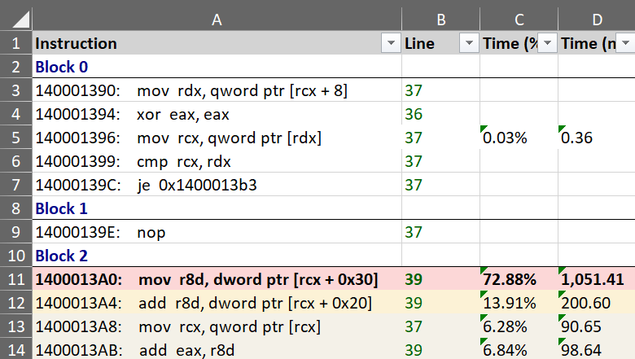{: style="width:480px"}](img/assembly-export-excel_780x441.png){:target="_blank"}
- HTML table (*.html)  
  [{: style="width:480px"}](img/summary-export-html_1209x287.png){:target="_blank"}
- Markdown table (*.md)  
  [{: style="width:480px"}](img/assembly-export-markdown_984x365.png){:target="_blank"}

The Export menu in the toolbar also has an option to copy to clipboard the function's assembly as a HTML/Markdown table (pasting in an application supporting HTML - such as the Microsoft Office suite and online editors - will use the HTML version, code/text editors will use Markdown version instead).  

The Ctrl+C keyboard shortcut copies to clipboard only the selected instructions as a HTML/Markdown table.

#### View options

*Click* on the *Gears* icon in the top-right part of the view displays the options panel (alternatively, use the *Assembly Code* tab in the application *Settings* window.).  

The tabs below describe each page of the options panel:  
=== "General"
    [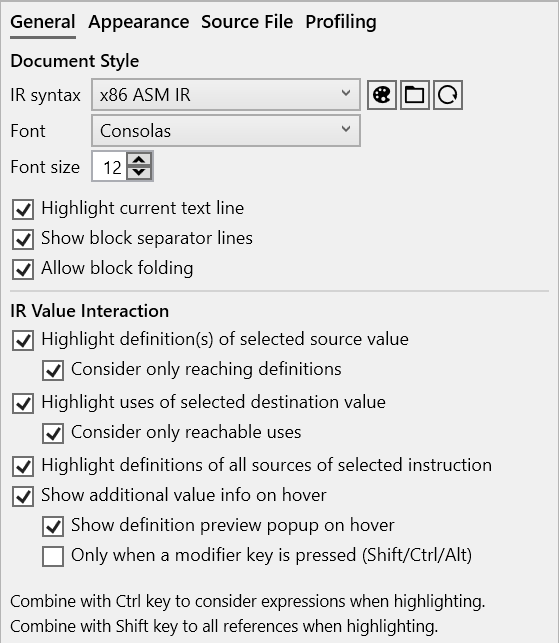{: style="width:400px"}](img/details-panel-info_565x786.png){:target="_blank"}  

=== "Appearance"
    [{: style="width:400px"}](img/assembly-options-appearance_554x501.png){:target="_blank"}  

=== "Source File"
    [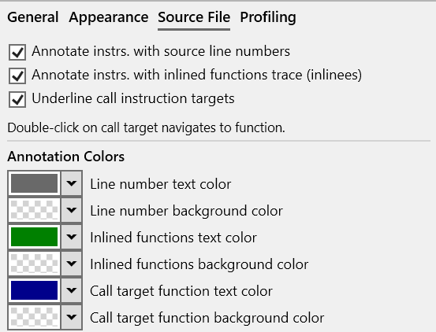{: style="width:400px"}](img/assembly-options-source_553x422.png){:target="_blank"}  

=== "Profiling"
    [{: style="width:400px"}](img/assembly-options-profiling_555x758.png){:target="_blank"}  

#### Column options

*Right-click* on a column, such as the *Time* columns, displays the option panel that allows changing the style and displayed information by the selected column. Each column can have a different style if desired.  

[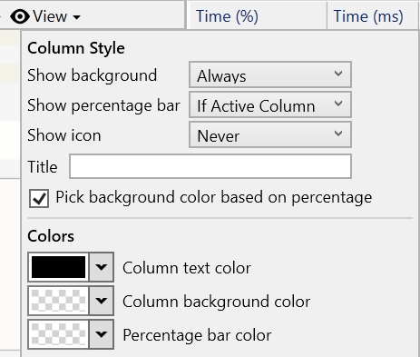{: style="width:320px"}](img/assembly-column-options_463x393.png){:target="_blank"}  

#### Documentation in progress
- View options
- Column options