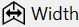
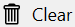

#### Overview

The Flow Graph view displays the [control-flow graph (CFG)](https://en.wikipedia.org/wiki/Control-flow_graph) of the function viewed in the active assembly view.  

The function CFG makes it easier to see the structure of a function and control-flow created by jumps, branches, and loops. The slowest [basic blocks](https://en.wikipedia.org/wiki/Basic_block) are annotated with profiling information.  

[{: style="width:320px"}](img/flow-graph-view_501x693.png){:target="_blank"}

The view has two parts:  

- a main toolbar at the top, with general action buttons.
- an interactive CFG area, supporting zooming and panning.

Each basic block is represented by a rectangle, with the block number as the label. An edge between two blocks means the source and destination block are connected either through a jump/branch or fall-through code.  

##### Color coding

Different colors of the blocks and edges are used to help identify control flow. The used colors can be customized in the [Flow Graph options](#view-options).

Block border colors coding (default colors):  

- blue: blocks ends with a branch instruction.
- green: block is the target of a loop back-edge (it's a loop header).
- red: block ends with a return instruction (it's a function exit),

Edge color coding (default colors):  

- blue: target block is a branch target (branch in the source block jumps to it).
- green: loop back-edge, target block is a loop header (start of a  loop).
- red: target block is a function exit block.
- dotted: target block is the [immediate dominator](https://en.wikipedia.org/wiki/Dominator_(graph_theory)) of the source block.

##### Selection sync

When a block is selected, the corresponding instructions are also selected in the *Assembly* view, like in the example below where B5 is selected. Notice that B5 is a single-block, nested loop, while B4 is the loop header block of a larger loop including B5.  

{:target="_blank"} 

#### Profiling annotations

Blocks with a significant execution time are marked by using bold text for the block number and changing their background color (same color coding as in the *Assembly view*).  

A label is displayed underneath with the block's execution time percentage relative to the function's total execution time.

#### View interaction

???+ abstract "Toolbar"
    | Button | Description |
    | ------ | ------------|
    |  | Resets the view to it's original state. |
    |  | Zooms out the view around the center point. |
    |  | Zooms in the view around the center point. |
    |  | Resizes the view so that the width of the graph matches the available horizontal area. |
    |  | Resizes the view so that the entire graph is visible. |
    |  | Displays a menu with options for clearing marker for the selected block or all blocks. |

???+ abstract "Mouse shortcuts"
    | Action | Description |
    | ------ | ------------|
    | Hover | Hovering over a block displays a preview popup with the corresponding instructions from the *Assembly* view. |
    | Click | Selects a block and also selects the corresponding instructions the *Assembly* view (can be configured in the [Flow Graph options](#view-options)) |
    | Right-click | Shows the context menu for the selected block. |
    | Click+Drag | Clicking on and dragging an empty part of the view moves the view in the direction of the mouse. |
    | Scroll wheel | Scrolls the view vertically if graph is larger than the view. |
    | Ctrl+Scroll wheel | Zooms in or out the view around the mouse pointer position. |

???+ abstract "Keyboard shortcuts"
    | Keys | Description |
    | ------ | ------------|
    | Ctrl+= | Zooms in the view around the center point. |
    | Ctrl+- | Zooms out the view around the center point. |
    | Ctrl+0 Ctrl+R | Resets the view to the initial state. |
    | Ctrl+W | Resizes the view so that the width of the graph matches the available horizontal area. |
    | Ctrl+A | Resizes the view so that the entire graph is visible. |
    | Arrow keys | Scrolls the view in the horizontal and vertical directions if the flame graph is larger than the view. |

???+ abstract "Right-click context menu"
    [{: style="width:380px"}](img/flow-graph-context-menu_383x548.png){:target="_blank"}  

#### View options

*Click* on the *Gears* icon in the top-right part of the view displays the options panel (alternatively, use the *Flow Graph* tab in the application *Settings* window.).  

The tabs below describe each page of the options panel:  
=== "General"
    [{: style="width:400px"}](img/flow-graph-options-general_558x423.png){:target="_blank"}  

=== "Appearance"
    [{: style="width:400px"}](img/flow-graph-options-appearance_527x594.png){:target="_blank"}

#### Documentation in progress
- View options