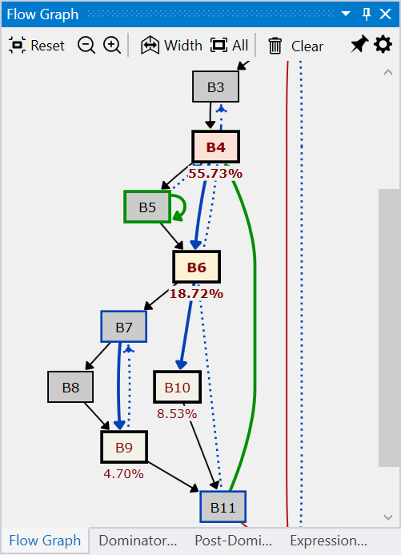
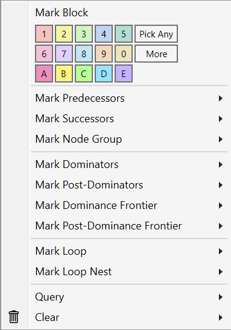
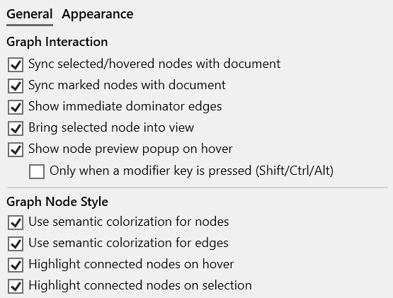
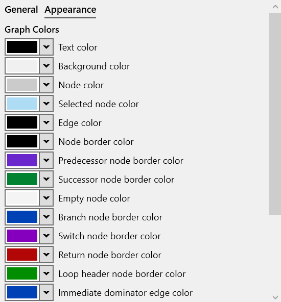

#### Overview

The Flow Graph view displays the [control-flow graph (CFG)](https://en.wikipedia.org/wiki/Control-flow_graph) of the function in the active assembly view, with basic blocks annotated with profiling information.

[{: style="width:320px"}](img/flow-graph-view_501x693.png){:target="_blank"}

The function CFG makes it easier to see the structure of a function, loops. Blocks and arrows color-coded, ex default colors for loops, exit blocks TODO

Example img with selection sync on block click.

{:target="_blank"} 

#### View interaction

???+ abstract "Toolbar"
    | Button | Description |
    | ------ | ------------|
    |  | If enabled, selecting a function also selects it in the other profiling views. |

???+ abstract "Mouse shortcuts"
    | Action | Description |
    | ------ | ------------|
    | Hover | Hovering over a function displays a popup with the stack trace (call path) end with the slowest function's instance. Pin or drag the popup to keep it open.|

???+ abstract "Keyboard shortcuts"
    | Keys | Description |
    | ------ | ------------|
    | Return | Opens the Assembly view of the selected function in the active tab. |

???+ abstract "Right-click context menu"
    [{: style="width:380px"}](img/flow-graph-context-menu_383x548.png){:target="_blank"}  

#### View options

*Click* on the *Gears* icon in the top-right part of the view displays the options panel (alternatively, use the *Flow Graph* tab in the application *Settings* window.).  

The tabs below describe each page of the options panel:  
=== "General"
    [{: style="width:400px"}](img/flow-graph-options-general_558x423.png){:target="_blank"}  

=== "Appearance"
    [{: style="width:400px"}](img/flow-graph-options-appearance_527x594.png){:target="_blank"}

- basic blocks coded by color
- edges color coding, red for exit block, green loop
- click on node selects block in assembly view, on ASM selects block
- profiling info annotates hot blocks (label below) and color
- mouse and keyboard shorcuts for zoom, pan