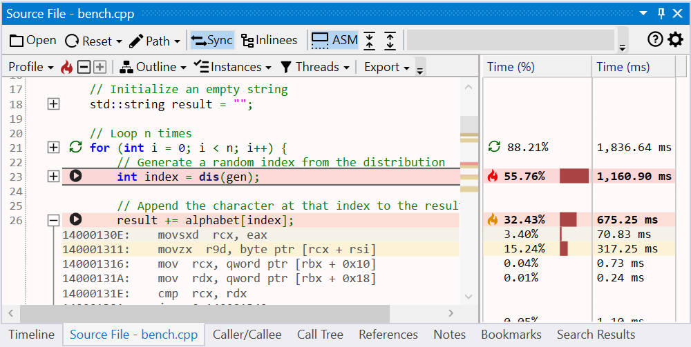
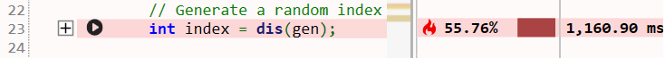
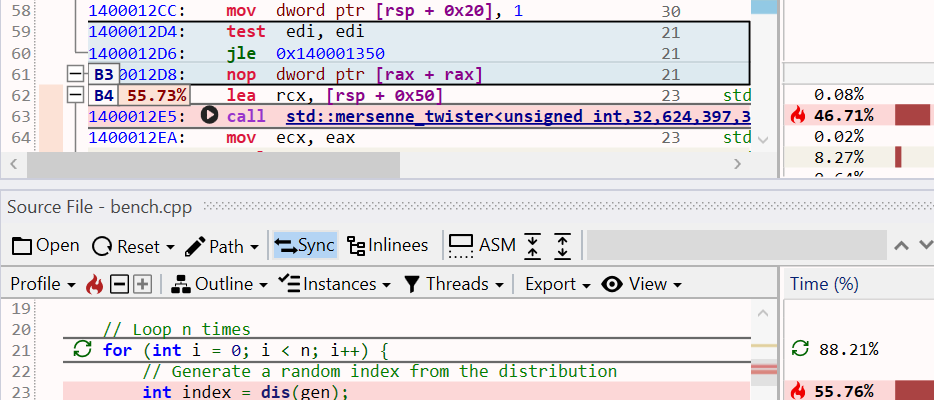
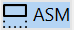
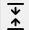
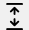
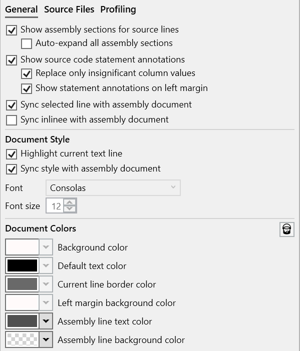
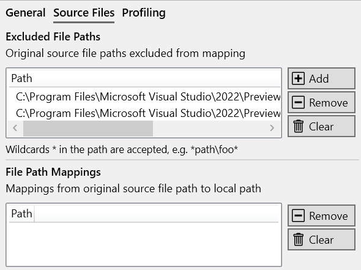
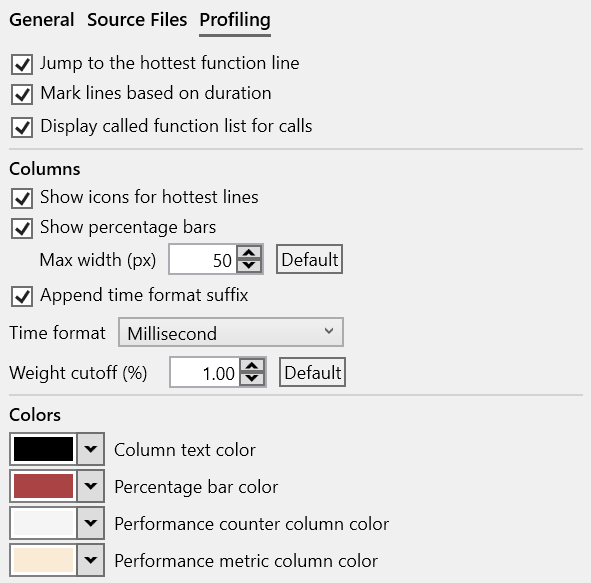

#### Overview

The Source File view displays the source code of the function viewed in the active *Assembly** view. When a function is opened in the **Assembly* view, using the debug info file, its corresponding source file is identified, downloaded if needed, and loaded in the view, with source lines annotated with profiling information.  

[](img/source-view_1000x503.png){:target="_blank"}

##### Finding source files

Locating the source file to load is done with the help of the debug info file, which usually records the file path associated with each function. In some cases, additional information is available to locate and download source files from remote locations and [Source Servers](https://learn.microsoft.com/en-us/windows/win32/debug/source-server-and-source-indexing).

Steps for locating a source file:  

- check the local file system using the debug info file path. This check handles the case of the trace being opened on the same machine where the application was built or the source is available at the exact file system location.
- check and download the source file from a [Source Server](https://learn.microsoft.com/en-us/windows/win32/debug/source-server-and-source-indexing) if the debug info file has additional remote file mapping information such as [SourceLink](https://github.com/dotnet/sourcelink) or built-in commands for retrieving the file. In case authentication is needed, it can be configured in the *Load Profile Trace* window [options](trace-loading.md#authentication).
- if neither of the above steps works, ask the user to manually locate the source file on a local file system or network share. The mapping between the expected and actual source file locations is saved across sessions when the application is closed. See the [Mapping source files](#mapping-source-file-locations) section below for more details.

Once a source file is available, its signature is computed and compared with the expected signature from the debug info file. If it does not match, it means the source file was modified between the time the application was built and the trace being loaded, and the file will be rejected (a future version will allow ignoring such a mismatch).  

##### Missing source files

If a source file cannot be found, the app will show a dialog asking if it should continue trying to locate the same source file in the future; if not, the file is added to an exclusion list saved across sessions.  

The same dialog also has the option to stop asking to locate source files manually during the current session altogether.

Use the *Reset* button in the toolbar to remove the exclusion from the current file, all files or clear all exclusion and mapping settings. The [Source File options](#view-options) displays editable lists of exclusions and mappings.  

##### Mapping source file locations

When a local source file is manually selected, a mapping between the original debug file path and the local file path is created. This mapping is used to locate the same source file later and to help locate other source files found in the same or a nearby location.  

For example, if the original path from the build machine was saved in the debug info file as:  
```C:\server\src\subdir\source.cpp```

and the selected local file path is:  
```D:\local\project\src\subdir\source.cpp```

several path mappings are created between the original and local directories such as:  
```C:\build\src\subdir  ->  D:\local\project\src\subdir```  
```C:\build\src  ->  D:\local\project\src```  
```C:\build  ->  D:\local\project```  

When another source file is searched, starting with the debug info path, the mappings are used to locate it in the local file system. The mapping also works with intermediate directories between the file name and the mapped directories. For example:

```C:\build\src\other\nested\subdir\file.cpp``` found as  
```D:\local\project\src\other\nested\subdir\file.cpp```

#### Source code view

The view is similar to the *Assembly* view, having four parts:  

- a main toolbar at the top, with general action buttons.
- a secondary toolbar underneath with profiling-specific info and action buttons.
- the text view with the source file.
- several columns on the right side with the profiling data for each source line. If CPU performance counters are found and loaded from the trace, the additional columns with metrics and the counters are appended after the last column.  

Each line corresponds to one source line, with the following values and buttons from left to right:

[{: style="width:550px"}](img/source-line_911x65.png){:target="_blank"}

- source line number.
- optional ASM section expand/collapse +/- button.
- optional marking icons for statements and call targets.
- source line text.
- profiling data columns, such as the execution time percentage and value.

##### Selection sync

When a source line is selected, if *Sync* is enabled in the toolbar, the associated instructions are also selected in the *Assembly* view.  

In the example below, the start of the loop on line 21 is selected, with the instructions forming the loop header selected in the *Assembly* view; the selected instructions corresponding to the loop back-edge are not visible in the screenshot.

[](img/source-selection-sync_934x400.png){:target="_blank"}

Vice versa, selecting an instruction in the *Assembly* view also selects the corresponding source line.

##### Profiling annotations

Similar to the *Assembly* view, execution time is displayed and annotated on several parts of the source lines and columns using text, colors, and flame icons:

- the *Time (%)* column displays the source line's execution time percentage relative to the total function execution time. The column style can be changed in the [Source File options](#view-options).
- the *Time (ms)* column displays the source files's execution time value. The time unit and column style can be changed in the [Source File options](#view-options).
- the source line background is colored based on its execution time - the slowest source line has a red color, next slowest orange, then shades of yellow. The line is also marked in the vertical text scrollbar.
- the three slowest source lines also have a flame icon in the *Time (%)* column using the same color coding.

When loading a source file, the slowest source line is selected and brought into view by default (this can be configured in the [Source File options](#view-options)).  

To jump at any time to the slowest source line, *click* the  icon from the toolbar or the *Ctrl+H* keyboard shortcut.  

???+ note
    When multiple source lines are selected, the application status bar displays the sum of their execution time as a percentage and value.  
    [](img/source-selection_983x255.png){:target="_blank"}

##### Assembly code sections

IIf enabled, each source line is followed by a section with the assembly instructions generated for it based on the debug info file. By default, the sections are collapsed and can be expanded by *clicking* the + button on the left of the source lines. Each line of assembly has the same profiling annotations as the source lines.

[](img/source-assembly_816x233.png){:target="_blank"}

To view the assembly sections, toggle the ASM button in the toolbar (enabled by default). The *Expand* and *Collapse* buttons in the toolbar can be used to toggle the visibility of all assembly sections together.

##### Call targets

Combining the parsed assembly code and profiling information, source lines with associated call instructions are marked with their target(s) and have an arrow icon placed before the call opcode:  

- for direct calls (target is an function name/address), a black arrow is used.
- for indirect or virtual function calls (target is a register or memory operand), a green arrow is used.

*Hovering* with the mouse over the arrow displays a list of target functions with details about their execution time. Note that the list may contain a function that doesn't appear directly in the source code due to function inlining, like in the example below.

[](img/source-call-target_845x164.png){:target="_blank"}

##### Source code outline

On load, source files are parsed using [tree-sitter](https://tree-sitter.github.io/tree-sitter/) in order to build an [Abstract Syntax Tree (AST)](https://en.wikipedia.org/wiki/Abstract_syntax_tree). The AST identifies and marks some of the high-level parts of the function's source code, such as if/else/switch statements, for/do/while loops, and call expressions. The supported languages are C, C++, C#, and Rust.  

For each such statement and expression, the execution time is computed by accumulating the time of each source line found in its range. This makes it easier, for example, to see the amount of time spent in an entire *loop* (or *nested loop*), the *then/else* branch of an *if* statement, or a specific *case* of a *switch* statement.  

Source lines that start a statement are marked with an icon based on the statement kind on the left side and in the execution time percentage column (configurable in the [Source File options](#view-options)).  

*Hovering* with the mouse over a statement marking shows its execution time as a percentage and value relative to the function time and highlights the source lines part of the statement.  

[](img/source-outline-loop_991x228.png){:target="_blank"}

Use the *Outline* button from the profiling toolbar displays to display a menu summarizing the nested statements and their execution time. Each menu entry has the source line number, statement kind icon, statement start source code, execution time percentage, and value.  

*Click* on a menu entry to jump to the statement start. *Hovering* with the mouse over a menu entry highlights the source lines part of the statement.

The example below shows the outline of a function having three nested loops, with if/else statements in the last level loop.

[](img/source-outline_953_289.png){:target="_blank"}

#### Profiling toolbar

The profiling toolbar provides more advanced functionality for identifying the slow parts of a function and filtering the profiling data based on a function instance and the threads the function executed on. The following sections document the main functionality.  

##### Profile

Displays a menu with the slowest source lines, sorted by execution time in decreasing order. Even if assembly sections are enabled, instructions are not included.  

- *Click* on a menu entry to select and bring the source line into view.  
- *Click* the  icon to jump to the slowest source line in the function.  
- *Click* the +/- buttons to jump to the next/previous slowest source line in the sequence.

[{: style="width:550px"}](img/source-profile_920x251.png){:target="_blank"}  

##### Outline

Displays a menu that summarizes  the nested statements and their execution time.  
See the [Source code outline](#source-code-outline) section above for documentation.

##### Instances

The Instances menu displays the call paths leading to all instances of the function, with their execution time percentage and value, similar to the *Assembly* view feature.  

See the [Profiling toolbar: Instances](assembly-view.md#instances) section in the *Assembly* view page for details.

##### Threads

The Threads menu displays the threads IDs and their execution time percentage and value, similar to the *Assembly* view feature.  

See the [Profiling toolbar: Threads](assembly-view.md#threads) section in the *Assembly* view page for details.

#### View interaction

???+ abstract "Toolbar"
    | Button | Description |
    | ------ | ------------|
    |  | Shows an *Open File* dialog to select a local source file to load in the view. |
    |  | Displays a menu with options for resetting exclusions set on the current source file or all source files. |
    |  | Displays a menu with options for copying the source file path to clipboard, navigating to the source file in *File Explorer* and opening the source file in the default editor. |
    |  | If enabled, selecting a source lines also selects all associated instructions in the *Assembly* view. |
    |  | If enabled, each source line is followed by a section with the assembly instructions generated for it, based on the debug info file. See [Assembly code sections](#assembly-code-sections) above for details. |
    |  | Hides (collapses) all assembly sections. |
    |  | Shows (expands) all assembly sections. |
    |  | Opens the current source file into a new preview popup. |

#### Exporting

The function's source code, combined with profiling annotations and execution time can be exported and saved into multiple formats, with the slowest source lines marked using a similar style as in the application:

- Excel worksheet (*.xlsx)  
  [{: style="width:480px"}](img/source-export-excel_876x439.png){:target="_blank"}
- HTML table (*.html)  
  [{: style="width:480px"}](img/source-export-html_926x537.png){:target="_blank"}
- Markdown table (*.md)  
  [{: style="width:480px"}](img/source-export-markdown_987x453.png){:target="_blank"}

The Export menu in the toolbar also has an option to copy to clipboard the function's source code as a HTML/Markdown table (pasting in an application supporting HTML - such as the Microsoft Office suite and online editors - will use the HTML version, code/text editors will use Markdown version instead).  

The *Ctrl+C* keyboard shortcut copies to the clipboard only the selected source lines as a HTML/Markdown table.

#### View options

*Click* on the *Gears* icon in the top-right part of the view displays the options panel (alternatively, use the *Source File* tab in the application *Settings* window.).  

The tabs below describe each page of the options panel:  
=== "General"
    [{: style="width:400px"}](img/source-options-general_599x702.png){:target="_blank"}  

=== "Source Files"
    [{: style="width:400px"}](img/source-options-files_590x441.png){:target="_blank"}  

=== "Profiling"
    [{: style="width:400px"}](img/source-options-profiling_591x583.png){:target="_blank"}  

#### More documentation in progress
- options panel