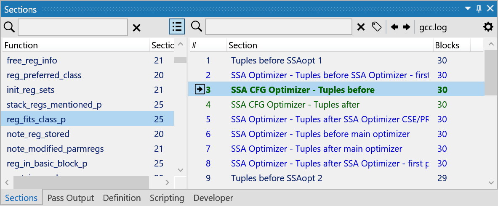
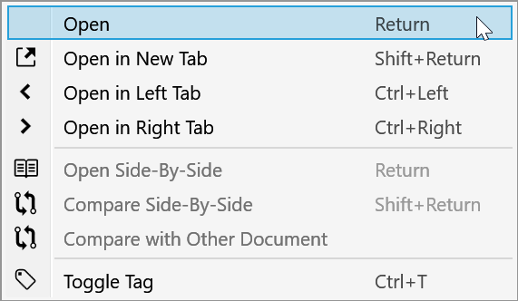
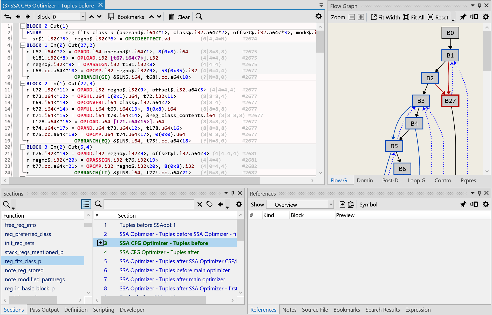
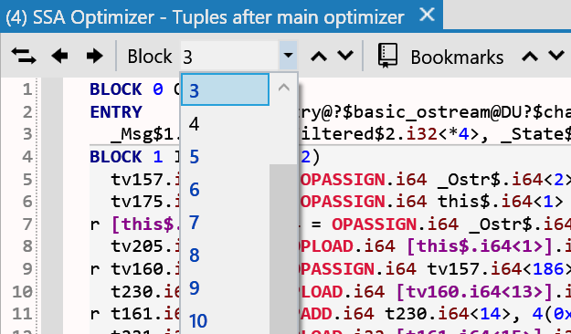
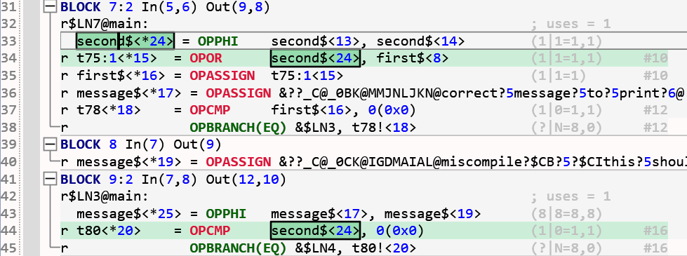
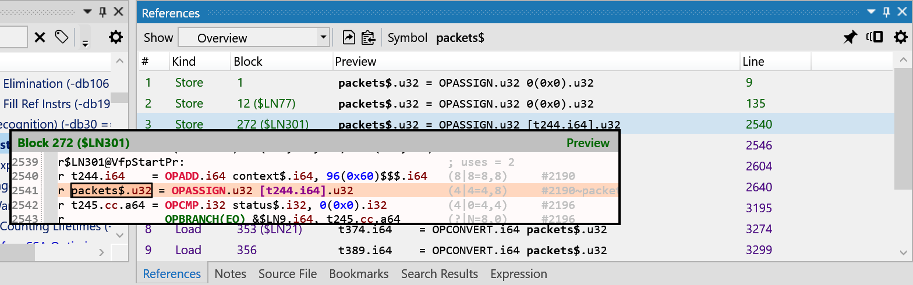
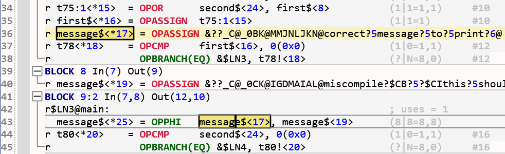
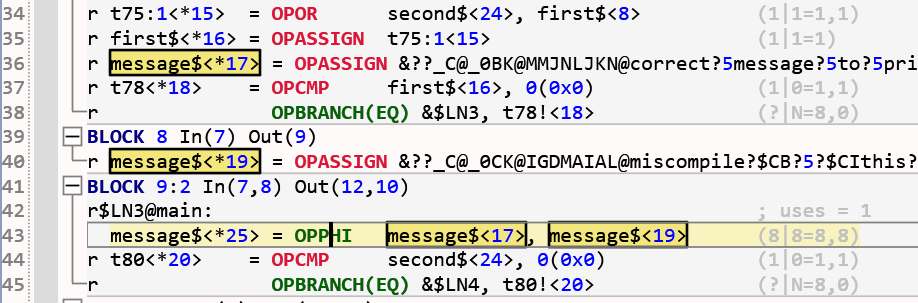
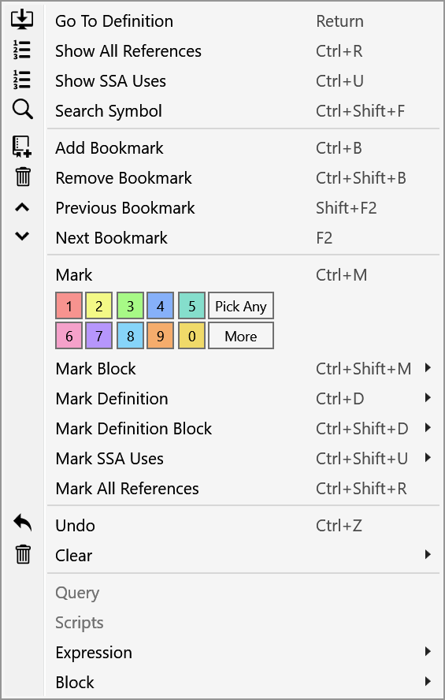
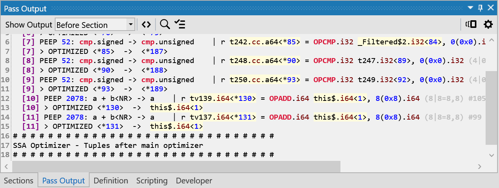

### Download and installation

Installation is done through a typical setup application:  
[**Download Setup**](file://ir-explorer/app/setup.exe)  

Once the setup completes, an "IR Explorer" icon should appear in the Windows Start Menu.  
There is an auto-update system that regularly checks for new versions, showing an "Update Available" button in the UI. Accepting the update downloads the new version, closes the application, copies the files and re-launches the application.

!!! warning ""
    It is strongly recommended to install updates, since they fix bugs, improve the IR parsing and add new functionality.

### Demo videos

There are several videos in the [**Demos**](demos.md) section of this documentation.  
The video below is a short introduction to the UI and some of the main concepts presented here. Other videos illustrate some workflows that are not yet properly documented (annotations, comparing sections and files), watching them is recommended.

<video width=700px  controls>
  <source src=video/intro.mp4 type="video/mp4">
</video>

### Opening files
The application supports one IR file being opened at a time, except in a special side-by-side diff mode that supports two files. There can be as many instances of the application opened as desired, allowing working with multiple files.  

IR files can be opened the usual way, using the *Ctrl+O (File -> Open)* keyboard shortcut to browse for a file. *Ctrl+Shift+O (File -> Open In New Window)* creates a new instance of the application.  

There is also a *Recent Files* list under the *File* menu that keeps a list of the last 10 most recent opened files. From the command line, files can be opened using:  

`irviewer.exe file_path`  

!!! note
    The irviewer directory (%ProgramFiles%\IR Explorer) must be on the PATH environment variable.  
    This should have been done automatically by the setup application.  

### Navigating files  
When an IR file is opened, it is scanned once to build a summary of the functions it contains, with the corresponding per-function sections in the order they appear in the file. This is fairly quick and allows opening IR files that are gigabytes in size if required.  

!!! warning ""  
    For smaller files (< 300 MB), the entire file is loaded in memory and then closed. Larger files are being kept open to load, on-demand, the IR of a section - this means that no other process can write to them while IR Explorer is open.

Once the file is loaded, the **Sections** panel shows on the left side the functions that have been found. When a function from the list is selected, its corresponding sections appear in the list on the right side.

!!! tip
    Both the function and section lists can be filtered by name using the search boxes on top.  
    Note that filtering uses a case-insensitive substring search.

### Viewing sections  
To open a section, either *double-click* on it or press the *Return* key after selection.  
It is possible to have multiple sections open at the same time, even from different functions. The docking system makes it easy to have a side-by-side view of two sections, for example.

To see more options for opening and docking a section, right-click on a section and the following menu will appear (note the keyboard shortcuts):

{:style="width:50%"}

---
When a section is opened, there are several tasks done in the background:

* syntax highlighting of the IR (opcodes, operands, types, numbers, etc.)
* parsing of the function IR into the generalized IR used internally. This enables all the functionality that is available by having a semantic understanding of the IR.
* displaying basic block separator lines and enabling code folding.
* generating and computing the layout of several graphs, such as the *flow graph*, *dominator tree*, *post-dominator tree* and displaying them in the corresponding panels.

!!! note Read-only  
    The section text itself is read-only, but there are several ways to annotate the text using colors, bookmarks and notes to mark important IR elements. Switching between sections saves/restores all these annotations.

### Interacting with a section

#### Jumping between basic blocks

There are several ways to jump between the basic blocks in a section:

* Using the *Block* dropdown part of the top toolbar and the *Up*/*Down* buttons next to it:
{:style="width:50%"}

* Using the *Ctrl+Arrow Up* and *Ctrl+Arrow Down* keyboard shortcuts to jump to the previous/next block.

* Selecting the block in one of the graph panels, such as the *Flow Graph*.

!!! tip
    Press the *Alt+G* keys to show the block dropdown, type the block number and press *Return* to jump to the block.

---
#### Viewing instruction uses

The uses of an instruction are highlighted when the destination operand is selected. Each use, including the user instruction is being highlighted in the text view, on the vertical scroll bar and in the flow graph, where the user's blocks are marked. By default a green color is used.

!!! warning ""
    With SSA info available, only the uses of the selected SSA definition are highlighted (using the definition-use links). Without SSA, all uses of the destination symbol are highlighted, which may include places where the value is not available anymore (no liveness analysis is done).

!!! note "Reference Panel"
    The Reference Panel displays the use information in the form of a list, making jumping to a reference easier. If the mouse hovers over an entry in the list, a preview popup is displayed showing the exact location of the reference in the document.
    

---
#### Viewing operand definitions

The instruction defining a variable operand is highlighted when a source operand is selected. Both the destination operand and the instruction are highlighted in a similar way to the use case, but using a yellow color by default.

!!! tip
    * Selecting label operands (used by transfer instructions such as branch/jump/switch)   highlights the label definition in the corresponding basic block.
    * Hovering over an operand while pressing the *Shift* key highlights the definition temporarily. If the definition is outside the document view, a previous popup is displayed.
    * *Ctrl+Click* on a source highlights an entire expression with colors based on the depth in the expression DAG.

!!! warning ""
    With SSA info available, only the definition of the selected operand is highlighted (using the use-definition link). Without SSA, all instances of the symbol used as a destination operand are highlighted, which may include places that don't define the value being used (no liveness analysis is done).

When an instruction opcode is selected (instead of one of its destinations/sources), the definition of every source operand is highlighted.

---
#### Go to definition

*Double-clicking* on a source operand, or pressing the *Return* key when a source operand is selected jumps to the definition. This also works with label operands in transfer instructions.

!!! warning ""
    With SSA info available, the jump is made to the SSA definition (using the use-definition link).  
    Without SSA, a jump is made only if there is a single potential definition of the source symbol.

!!! tip 
    *Ctrl+Z* (Undo) jumps back to the previous position in the section document, to the IR element that triggered the "go to definition" action. Most actions, such as annotations and bookmarks, can be undone.

---
#### More interaction options

Many more ways of interacting with and annotating the IR are available through keyboard shortcuts and when right-clicking on IR elements:  

{:style="width:50%"}
  
### Viewing additional output

Often there is additional output from the compiler besides the IR sections, such as tracing/logging messages with remarks about instructions that could (or could not) be optimized, etc. These can be viewed in the *Pass Output* panel, which can show the additional text found either before or after a section.

!!! tip
    Operands used in the section are identified and highlighted (light yellow). Clicking on these operands jumps to the definition in the section; if the mouse hovers over them a definition preview popup is displayed.

### Saving work
A session is composed of the IR file(s) being opened and all the annotations, bookmarks and notes found on various sections. Sessions can be saved into a single, compressed file (IRX extension) that basically contains everything needed to resume work later or share it with someone else. When opening a session file, the original IR file is decompressed and section documents left opened are restored in the state they were left. A 10x compression factor is usually seen with compiler IR, making file size not really a concern.  

To save a session, use the *Ctrl+S (File -> Save Session)* shortcut. Session files are opened just like IR files, they are detected when opening by their IRX extension.

### Auto-saving work
There is an auto-saving system that runs in the background, saving the current session every 2 minutes, so that in case there is a crash of the application, unsaved work can be restored.  

### Changing document style and other options
Editing the document/graph styles and other application options are work in progress, but it's possible already to change many aspects in the text and graph viewer, such as fonts, colors and some of the UI interaction. Experimental support for themes is also available.

To open the settings panel, click on the "gears" icon in the top-right corner of the document editor or graph panels - settings for the other panels are not yet implemented.

  

!!! tip
    The colors of the IR syntax highlighting can be customized:  
    {:style="width:50%"}

{:style="width:50%"}
