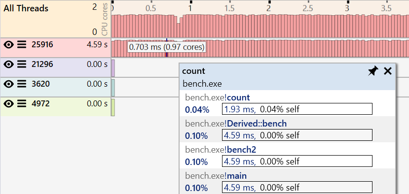
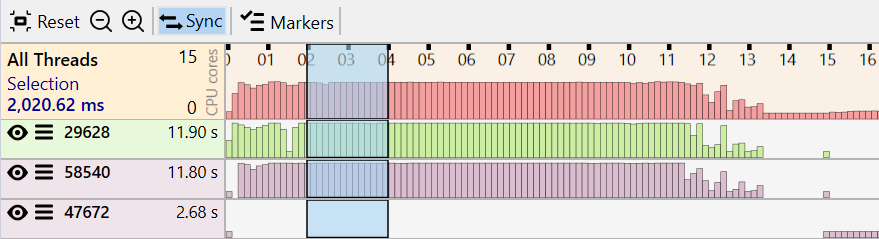
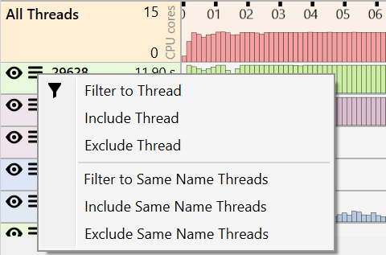
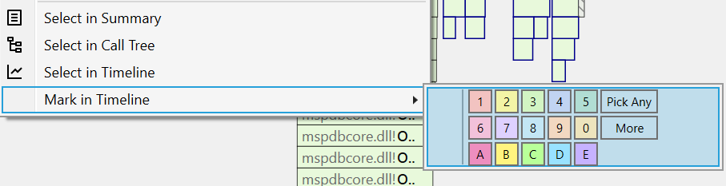

#### Overview

The Timeline view displays the application's activity for the entire trace duration, with each thread having a histogram showing the CPU usage based on the number of profile samples collected over time.  

This view helps identify the threads and time ranges with CPU activity (or lack thereof due to locks and I/O). It also has features for filtering the entire profile data to consider only specific threads and time ranges.  

{:target="_blank"}

The view has three parts:

- a main toolbar at the top, with general action buttons.
- a graph showing the activity of the entire application, with the activity across all threads combined.
- for each thread, a graph showing the thread's activity. The thread list is sorted by the execution time in descending order.

The *All Threads* entry displays the trace duration range on top, split into time units. The maximum number of CPU cores the application uses is displayed on the left. Individual threads use, at most, one core.  

Each individual thread entry has the following values and buttons:

[{: style="width:500px"}](img/timeline-threads_599x159.png){:target="_blank"}

- thread visibility button indicating if the samples from the thread are included in the profile data or not. *Click* to toggle between included  or excluded state .
- thread context menu button  that shows thread filtering actions.
- the thread ID number.
- the thread execution time as a sum of the duration of all samples that ran on the thread.
- if available in the trace, the thread name.
  
#### Mouse actions

*Moving* the mouse over the graphs shows the time position and the approximate number of cores used at that point.

[{: style="width:500px"}](img/timeline-position_570x116.png){:target="_blank"}

*Hovering* with the mouse over the graph shows a preview popup with the slowest call path (stack trace) active at that point.  

[{: style="width:600px"}](img/timeline-hover_829x394.png){:target="_blank"}

*Clicking* a thread ID or name creates a time range selection for the thread covering the entire trace duration. If *Sync* is enabled in the toolbar, all functions executing on the selected thread are also selected in the other profiling views.  

##### Selecting a time range

- To select a time range that includes all threads, *click and drag* over the desired range in the top *All Threads* graph. The duration of the current selection is displayed in the top *All Threads* graph. Note that if some threads are excluded, the selection will not consider them.  
  
    {:target="_blank"}

- To select a time range for a single thread, *click and drag* over the desired range in the specific thread graph. To include another thread in the same time range, from the thread action menu, click *Include thread* or use the  icon.  
    
    {:target="_blank"}

???+ note
    If the *Sync* option is enabled, selecting a time range also selects the functions executing during that time in the other profiling views, considering if all threads or a subset are included.

#### Filtering the profile

The entire profile can be filtered so that only specific threads and time ranges are displayed, with the profiling views updated to include only the profile samples accepted by the filter. The active filter is displayed in both the toolbar and the application menu bar.

##### Filtering based on a time range

Select the desired time range, then *double-click* the selection (alternatively, right-click the selection and click "Filter to Time Range*). If a single thread is selected, a filter that displays only the selected thread and excludes all others is also added.  

{:target="_blank"}
    
##### Filtering based on a thread

There are multiple ways to filter based on one or multiple threads, optionally combined with a time range filter.  

[{: style="width:350px"}](img/timeline-thread-menu_480x317.png){:target="_blank"}

- to include a single thread and exclude all others, *double-click* the thread ID or *click* *Filter to Thread* from the thread action menu.
- to include another thread, click the  icon or *click* *Include Thread*.
- to include all threads with the same name and exclude all others, *click* *Filter to Same Name Threads*.
- to include all threads with the same name, *click* *Filter to Same Name Threads*.
- to exclude a thread, click the  icon or *click* *Exclude Thread*.
- to exclude all threads with the same name, *click* *Exclude Same Name Threads*.

Example of a filter including a single thread (58540) and a time range of ~2 sec. Excluded threads and time ranges are displayed using faded colors. Use the X buttons next to *Time* and *Threads* in the toolbar to remove the filter.

{:target="_blank"}

#### Marking samples

The samples corresponding to a function instance can be marked from the *Flame Graph view* using the right-click context menu of a node and selecting a color from the *Mark In Timeline* menu entry. 
{:target="_blank"}

The *Markers* menu in the toolbar displays the currently marked functions.   
*Click* on a menu entry to remove the marker.  

{:target="_blank"}

#### View interaction

???+ abstract "Toolbar"
    | Button | Description |
    | ------ | ------------|
    |  | Resets the view to it's original state, displaying the thread graphs for the entire trace duration. |
    |  | Zooms out the thread graphs and updates the time units. |
    |  | Zooms in the thread graphs and updates the time units. |
    |  | If enabled, selecting a time range also selects executing during that time in the other profiling views. |
    | Markers | Search for nodes with a specific function name using a case-insensitive substring search. Press the *Escape* key to reset the search or the *X* button next to the input box. |

#### Documentation in progress

- View options