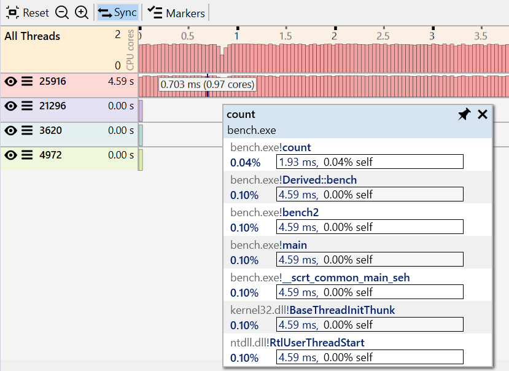

#### Overview

The Timeline view displays the activity of the application for the entire duration of the trace, with each thread having a histogram showing the CPU usage based on the number profile samples collected over time.

This view is helpful to identify the threads and time ranges that had CPU activity (or lack of it due to locks and I/O) and also has features for filtering the entire profile data to consider only specific threads and time ranges.

{:target="_blank"}

The view has three parts:

- a main toolbar at the top, with general action buttons.
- a graph showing the activity of the entire application, with the activity across all threads combined.
- for each thread, a graph showing the thread's activity. The thread list is sorted by the execution time in descending order.

Each thread entry has the following values and buttons:

- "eye" button indicating if the thread is included in the profile data or not. Click to toggle between included or excluded state. 2 pics with icon states
- "stacks" button that shows a menu with thread actions for filtering.
- the thread ID.
- the thread execution time, as a sum of the duration of all samples that ran on the thread.
- if available in the trace, the thread name.

{:target="_blank"}

Hover
- gliding over show time position and CPU usage
- hover longer shows call stack of slowst samples

Selecting a time range:  

- To select a time range that includes all threads, *click and drag* over the desired range in the top *All Threads* graph. The duration of the current select is displayed in the top *All Threads* graph.
    {:target="_blank"}
- To select a time range for a single thread, *click and drag* over the desired range in the specific thread graph. To include another thread in the same time range, from the thread action menu click *Include thread* or use its *Eye* icon.
    {:target="_blank"}

???+ note
    If the *Sync* option is enabled, selecting a time range also selects the functions executing during that time in the other views.

##### Filtering

When filtering the entire profile data to consider only specific threads and time ranges, all views are updated and recomputed to consider only the included samples. The current filter is displayed in both the toolbar and in the application menu bar.

Filtering based on a time range: select the desired time range then *double-click* the selection (alternatively, right-click the selection and click "Filter to Time Range*).

- time range
    {:target="_blank"}
    
Filtering based on a thread:

- to include a single thread, *double-click* the thread name, or *click* "Filter to Thread* from the thread action menu.
- to include another thread, click its eye icon, or *click* "Include Thread" from the thread action menu.
- to include all threads with the same name, *click* the ...
- to exclude a thread, click the *eye* icon, or ...
- to exlude all threads with the same name, 

- threads
    {:target="_blank"}

- threads context menu
    {:target="_blank"}

Longer hover
{:target="_blank"}

Marking

{:target="_blank"}

- display all and each thread
- threads have ID and optional name, color code by name
- selection with sync selects functions executing in time range and thread (all threads when done on all)
- selection in other panels marks samples 
- right-click on selection context menu to filter by thread and time range. Also with double-click
- left of threads context menu to filter to, include, exclude, etc
- filterng also update top-level menu, shows active filter
- hover shows stack trace of hottest sample at point

TODO later:
- options panel