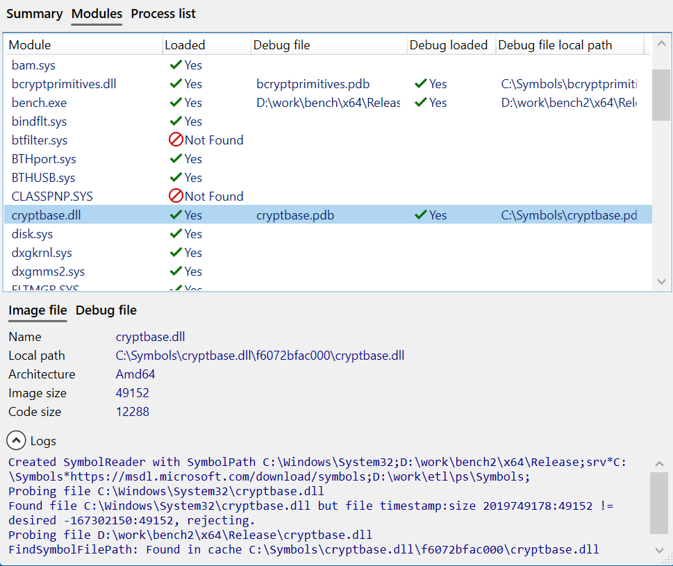

#### Overview

The *Profiling Trace Report* window provides details of the current profiling session, including the loaded trace path and process name/ID, trace recording time and duration, and the machine used to record the trace.

A list of modules referenced by the profiled code is also included, with the symbol search result for both binary and debug info files. The symbol search logs can help you understand why symbols could not be found, such as using wrong local directory paths or a symbol server being unreachable.

To view the report, once a trace is loaded *click* *Profiling report* from the *Profiling* menu. The report is also automatically displayed if a trace fails to load.  

##### Summary

{:target="_blank"}

##### Modules

Once a module is selected, the *Image file* and *Debug file* tabs are updated to show the symbol info used to look up the symbols.  

{:target="_blank"}

The *Logs* section displays the list of symbol search paths used during the search and the steps taken by the algorithm.  

???+ tip
    If a symbol file is found, but there is a timestamp/checksum mismatch, the symbol is not used and the next search path is queried.  

    If no matching symbols are found for the module, it usually means that the symbols are from a different version of the application than the one recorded in the trace.  

{:target="_blank"}